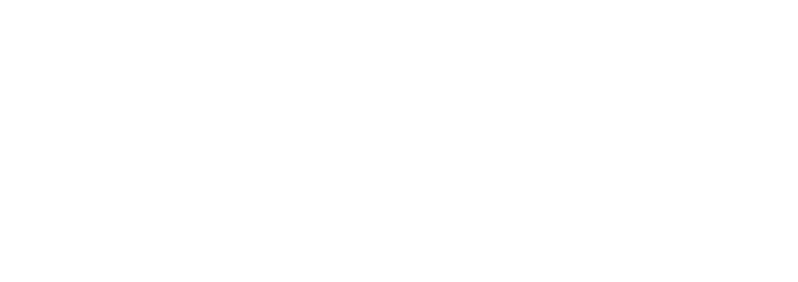

<div align="center">

  [](https://lamf5.vercel.app/)

  [](https://github.com/GabFrancoL/lamf5_backend/blob/main/LICENSE)

</div>

## Project

Frontend for the LAMF5's (Liga Acadêmica de Mercado Financeiro da UFV) website using NextJS, Apollo Client and Tailwind.

## Technologies

Implemented technologies:

- [NextJS](https://nextjs.org/)
- [Apollo Client](https://www.apollographql.com)
- [Tailwind](https://tailwindcss.com)
- [AntD](https://ant.design)

## Build

Install node dependencies:

```bash
npm install
```

Connect to the API (code available at: https://github.com/GabFrancoL/lamf5_backend):

```
DB_URI = $prod_url      // Database URI
```

Start the frontend:

```bash
npm start
```

If you want to start for testing on your local machine:

```bash
npm run dev
```

---

<p align="center">Developed and maintained by Gabriel Franco</p>